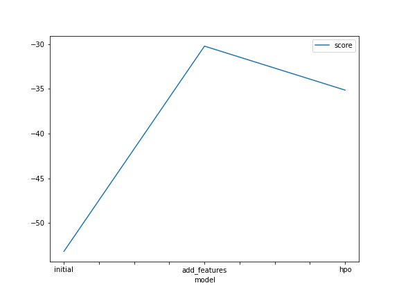
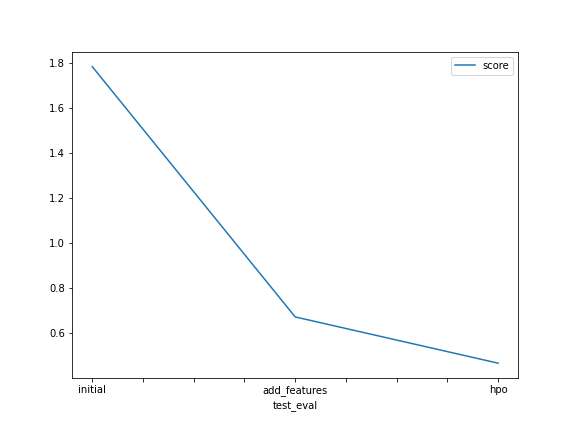


# Report: Predict Bike Sharing Demand with AutoGluon Solution

#### JAMES MICHAEL FRITZ

  

## Initial Training

### What did you realize when you tried to submit your predictions? What changes were needed to the output of the predictor to submit your results?

Im not sure why but i didn't get any predictions with negative values, but still i wrote the code to clip any negative values to 0. This precaution taught me to be more aware of my model outputs and not blindly trust them.

  

### What was the top ranked model that performed?

The top ranked model was WeightedEnsembleL3. Some of the best performing L1 models are LGBM, CatBoost, and RandomForest.

  

## Exploratory data analysis and feature creation

### What did the exploratory analysis find and how did you add additional features?

The EDA shows that some features that has continuous values aare actually discrete categorical features that needed to be treated. Some features have normal distribution such as 'temp' and 'atemp', and some features are skewed sch as windspeed and count.

I only created an additional feature of 'hour' from the 'datetime' because i saw from the output of the AutoGluon predictor that it already create day, month, year, and dayofweek so i don't need to create it manually.

  

### How much better did your model preform after adding additional features and why do you think that is?

It was very significant. I think its logical because different time 'hour' will have different demand (e.g. demand at midnight would be lower)

  

## Hyper parameter tuning

### How much better did your model perform after trying different hyper parameters?

Quite significant but not as much as adding new features.

  

### If you were given more time with this dataset, where do you think you would spend more time?

A better feature engineering might help other models to perform better. such as encoding cyclical features (hour, day, month). A more larger hyperparameter space might also boost the score.

  

### Create a table with the models you ran, the hyperparameters modified, and the kaggle score.

| model        | GBM                                                                                                                                 | CAT                                                                                                                            | RF                                                                                                                                   | score   |
|--------------|-------------------------------------------------------------------------------------------------------------------------------------|--------------------------------------------------------------------------------------------------------------------------------|--------------------------------------------------------------------------------------------------------------------------------------|---------|
| initial      | default                                                                                                                             | default                                                                                                                        | default                                                                                                                              | 1.78496 |
| add_features | default                                                                                                                             | default                                                                                                                        | default                                                                                                                              | 0.67234 |
| hpo          | { 'num_boost_round': ag.space.Int(lower=25, upper=100, default=200), 'num_leaves': ag.space.Int(lower=20, upper=80, default=40), }  | {     'iterations': ag.space.Int(lower=25, upper=100, default=200),     'depth': ag.space.Int(lower=3, upper=10, default=6), } | {     'n_estimators': ag.space.Int(lower=25, upper=200, default=100),     'max_depth': ag.space.Int(lower=3, upper=10, default=5), } | 0.46677 |

  

### Create a line plot showing the top model score for the three (or more) training runs during the project.

  
  

  

### Create a line plot showing the top kaggle score for the three (or more) prediction submissions during the project.

  
  

  

## Summary

In summary i successfully created a great performing model in a relatively short amount of time with AutoGluon and Sagemaker Studio. I learned how to perform basic feature engineering and hyperparameter optimization to improve a model significantly. The final model scored 0.46677 in Kaggle leaderboard.
